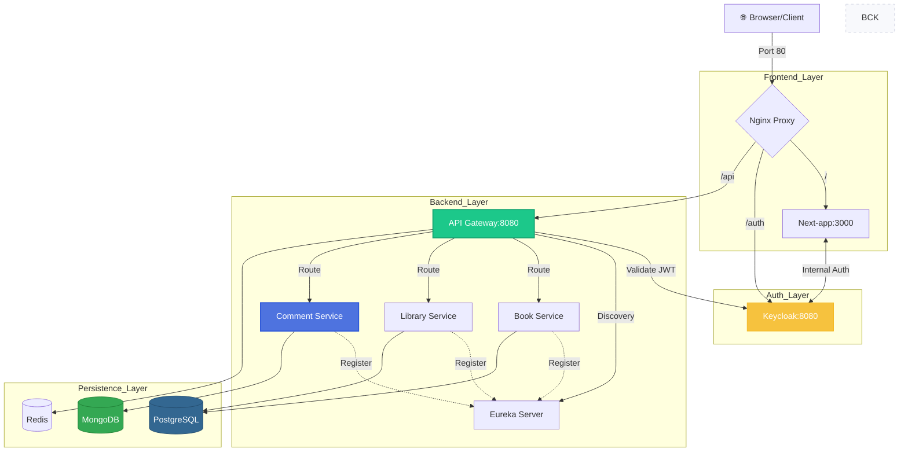

# 🚀 qm-service

Enterprise-grade **microservices platform** built with Spring ecosystem, focused on scalability, resilience, and observability.

---

## 📦 Overview

`qm-service` is a distributed system designed for high-load environments.  
It combines **reactive and blocking architectures**, integrates centralized security, and provides production-ready infrastructure.

---

## 🧩 Architecture

### 🔹 Nginx Edge Proxy (`nginx-proxy`)
High-performance reverse proxy acting as the unified entry point for the entire infrastructure.

**Tech:**

- Nginx Stable
- Custom Buffer Tuning (128k/256k)

**Responsibilities:**

- Unified routing for next-app, keycloak, and api-gateway
- SSL/TLS termination support
- Header sanitization and propagation (X-Forwarded-For, X-Real-IP)
- Optimized static content delivery and Gzip compression

---
### 🔹 Next Frontend (`next-app`)
Modern web application serving as the primary user interface.

**Tech:**

- Next.js 16.2.2 (App Router)
- Auth.js v5 (NextAuth)
- Tailwind CSS

**Capabilities:**

- Server-Side Rendering (SSR): High performance and SEO-friendly pages.
- Unified Auth Integration: Seamless login/logout flow via Keycloak.
- Edge-compatible: Optimized for deployment within the Docker-native environment.
- Responsive Design: Mobile-first UI for library management.

---

### 🔹 API Gateway (`api-gateway`)
Central entry point for all client requests.

**Tech:**
- Spring WebFlux
- Spring Cloud Gateway

**Responsibilities:**
- Routing requests
- Authentication & authorization
- Rate limiting
- Correlation ID propagation

---

### 🔹 Eureka Server (`eureka-server`)
Service discovery server for dynamic microservice registration and lookup.

**Tech:**

- Spring Cloud Netflix Eureka

**Responsibilities:**

- Service registration & discovery
- Health monitoring of services
- Dynamic routing support for Gateway

---

### 🔹 Book Service (`book-service`)
Domain service responsible for managing books.

**Tech:**
- Spring MVC
- Virtual Threads (Project Loom)
- Flyway

**Capabilities:**
- REST API: `/api/v1/books`
- Role-based access validation (via Gateway headers)
- Correlation ID logging
- Database migrations with Flyway

---

### 🔹 Library Service (`library-service`)
High-performance reactive service for library management operations.
**Tech:**

- Quarkus 3.33 (Reactive Stack)
- Kotlin & Coroutines support
- Hibernate Reactive with Mutiny
- Panache Entity/Repository pattern
- PostgreSQL Reactive Driver
- SmallRye Stork (Service Discovery & Registration)

**Capabilities:**

- Non-blocking I/O: Built on top of Vert.x for maximum throughput, optimized for limited resources (1 CPU / 1 GB RAM).
- Reactive Persistence: Fully asynchronous database communication using PanacheRepository for clean and expressive data access.
- Self-Healing Registration: Custom Eureka Watchdog (Kotlin) to ensure instant service re-registration after Eureka Server restarts.
- Stork Integration: Client-side load balancing and robust service discovery.
- REST API: `/api/v1/books` optimized for high-concurrency read/write operations without thread blocking.

---

### 🔹 Comment Service (`comment-service`)
Lightweight and scalable microservice for managing user engagement and social interactions.
**Tech:**

- NestJS 11 (Node.js 20+ Runtime)
- Mongoose (MongoDB Object Modeling)
- class-validator & class-transformer
- Eureka-JS-Client (Netflix Eureka Integration)

**Capabilities:**

- Non-blocking I/O Architecture: Built on top of Express/Fastify for high-concurrency handling of social interactions with minimal memory footprint (~60MB RAM in production).
- NoSQL Persistence: Optimized for unstructured data and rapid write operations using MongoDB, ensuring horizontal scalability for comment threads.
- Microservice Synergy:
  - Self-Registration: Automatically registers with eureka-server for dynamic discovery by the api-gateway.
  - Observability: Built-in Correlation ID propagation for end-to-end request tracing across the entire backend layer.
- Robust Validation: Strict DTO (Data Transfer Object) enforcement using global ValidationPipe to ensure data integrity before persistence.
- REST API: /api/comments endpoint supporting full CRUD operations and bookId-based filtering.

---

## ✨ Key Features

### ⚡ Performance
- Reactive Gateway (WebFlux)
- Virtual Threads for efficient concurrency
- Fully Reactive Stack (Vert.x Core + Hibernate Reactive)
- Resource Efficiency: Optimized for low-resource environments (1 CPU / 1 GB RAM per node).
- Non-blocking I/O: Fully asynchronous database communication in library-service. 


### 🔒 Security
- OAuth2 with Keycloak
- JWT-based authentication
- Stateless services
- Auth.js v5 Integration: State-of-the-art authentication layer for Next.js.
- Hybrid Keycloak Flow:
- Internal: Token exchange via Docker-internal network (AUTH_KEYCLOAK_INNER).
    - External: Browser-side redirection via Nginx for secure OIDC flow.
- Silent Logout: Custom front-channel logout with id_token_hint to bypass Keycloak confirmation screens.
- Token Rotation: Background refresh_token logic to maintain sessions without user interruption.

### 🚦 Rate Limiting
- Redis-backed rate limiter

### 🔁 Resilience
- Circuit Breaker (Resilience4j)
- Retry mechanisms
- Fallback strategies
- Self-Healing Registry: Custom Watchdog logic for instant Eureka recovery.
- Fail-safe Redis Integration: Non-blocking rate limiting with fallback strategies.

### 🔍 Observability
- Correlation ID propagation
- Structured logging
- Request tracing across services

### 🧭 Service Discovery
- Centralized registry via Eureka Server
- Dynamic routing in API Gateway
- Supports horizontal scaling of services

---

## 🏗️ Tech Stack

- Java 25 & Kotlin 2.3.10
- Next.js 15 & Auth.js v5
- Nginx (Reverse Proxy)
- Quarkus 3.33.1 (Reactive Stack)
- Spring Boot 4 (Spring MVC & WebFlux)
- Spring Cloud Gateway
- Keycloak (Identity & Access Management)
- Redis & PostgreSQL
- Flyway
- Docker
- Hibernate Reactive / Mutiny
- SmallRye Stork (Client-side Load Balancing)

---

## 🐳 Local Development Environment

Fully automated local setup using Docker.

### Services:
- Nginx (Gateway Port 80)
- Next-app (Frontend)
- PostgreSQL / Redis
- Keycloak
- Eureka Server / API Gateway
- Book Service / Library Service

### Run:

```bash
make local
```

### Requirements:
- Docker
- Make
- Maven

---

## 🔐 Authentication Flow

1. User accesses Next-app via Nginx.
2. Auth.js redirects browser to Keycloak (external URL).
3. After login, Next-app exchanges code for tokens via internal Docker network.
4. JWT is stored in a secure server-side session.
5. All backend requests from Next-app to API Gateway include the Bearer token.
6. Logout: Next-app clears local session and triggers a browser redirect to Keycloak for full SSO sign-out.

---

## 📄 License

MIT License

